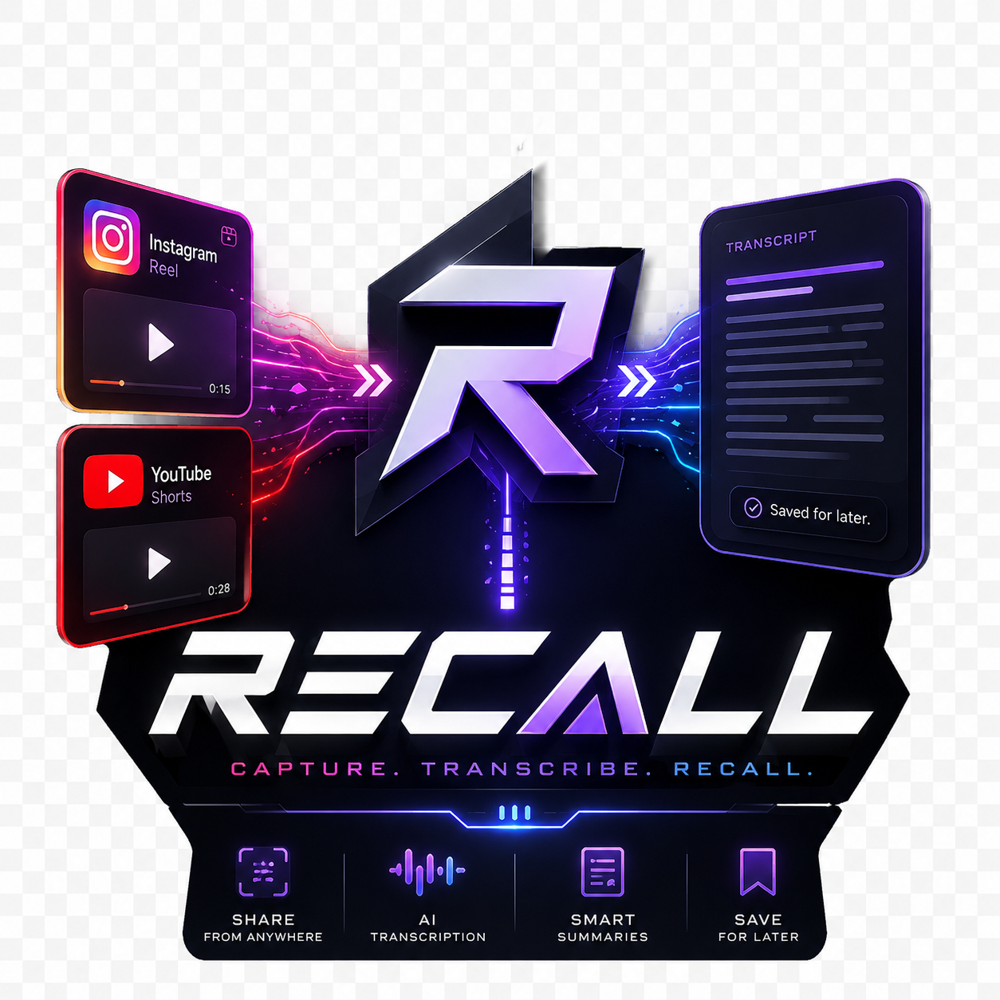

<p align="center">
  
</p>

# Recall

**Turn the things you watch and read into a searchable memory.** Share an Instagram reel, a YouTube link, or a screenshot into Recall — it transcribes/reads the content, summarizes the core information, auto-tags it by topic, and saves it locally. Weeks later, just *search* and find exactly what someone said (or what that infographic showed).

No account. No server. Your data stays on your phone.

---

## What it does

- **Share → save → forget.** Share a reel from Instagram (or a YouTube link, or a screenshot) into Recall and you're thrown straight back to scrolling — it processes in the **background** and pings you "Saved ✓" when done.
- **Reels & videos.** A bundled [yt-dlp](https://github.com/yt-dlp/yt-dlp) pulls the audio on your phone, then [Google Gemini](https://aistudio.google.com) turns it into a clean **transcript**, a catchy **title**, a tight **summary**, and a **topic** tag — in one call. The post's **caption** is captured too and fed in for sharper summaries.
- **Screenshots (text-in-image & carousels).** Share a screenshot — or several at once — and Gemini **reads all the text** (OCR) and summarizes it. Perfect for 10-slide infographic carousels and any text-heavy post. Works for *any* app's content, not just Instagram. Screenshots live in their own tab.
- **A real library.** Browse a card feed, **search** across every title, summary, transcript and caption, and **filter by 25 topics**.
- **Pick your model.** Choose your Gemini model in Settings — from fast & cheap (2.5 Flash) up to the newest/sharpest (3.5 Flash, 3.1 Pro).
- **Never lose one.** If a save fails (e.g. Gemini is briefly overloaded), it lands in a **retry queue** with the error — tap Retry (it reuses the download, no re-fetch) or Dismiss.
- **Export.** Save any single entry — or your whole filtered library — as a **PDF**.

## Privacy

- Your Gemini API key is stored **only on your device**.
- The only thing that leaves your phone is the reel's **audio** (or your **screenshot images**), sent to Google for analysis — exactly what any AI summarizer must do. Nothing else is uploaded; there is no Recall server.

## Setup (2 minutes)

<p align="center">
  <br>
  <em>Scan with your phone to download the latest <code>recall.apk</code></em>
</p>

1. **Install the app.** Scan the QR above (or download the latest `recall.apk` from [Releases](../../releases)), open it, and allow "install from unknown sources."
2. **Get a free Gemini key.** Go to [aistudio.google.com/apikey](https://aistudio.google.com/apikey), create a key (free tier is plenty for personal use).
3. **Paste it** into Recall → **Settings** → Save.

Then:
- **A reel/video:** open it → **Share → Recall**.
- **A post's images / a carousel / anything on screen:** screenshot it → **Share → Recall** (select multiple screenshots to send a whole carousel at once).

## Honest limitations

- **Reels: public only.** Private or age-restricted reels can't be fetched, and Instagram occasionally blocks a fetch — if one fails, try another (or just screenshot it).
- **Image posts/carousels** can't be fetched from Instagram's servers at all (they're login-walled) — that's exactly why the **screenshot** path exists. Screenshot the slides you want.
- **You bring your own Gemini key**, so any cost is yours (effectively free at personal volume; newer/Pro models use the free quota faster).

## Build from source

It's a standard Gradle Android project.

```bash
git clone https://github.com/rishabhdikhit/recall.git
```

Open the folder in **Android Studio** and hit Run, or from the command line:

```bash
./gradlew assembleDebug
# APK at app/build/outputs/apk/debug/app-debug.apk
```

Requires JDK 17 and the Android SDK (Android Studio bundles both). See [`docs/BUILD_JOURNAL.md`](docs/BUILD_JOURNAL.md) for how this was built (without Android Studio) and why.

## Tech

Native **Kotlin + Jetpack Compose** · **youtubedl-android** (embedded yt-dlp + ffmpeg) · **Gemini** (audio, video & vision) · local **SQLite** · background **foreground-service** ingest · on-device **PDF** export. No backend.

## License

[MIT](LICENSE)
